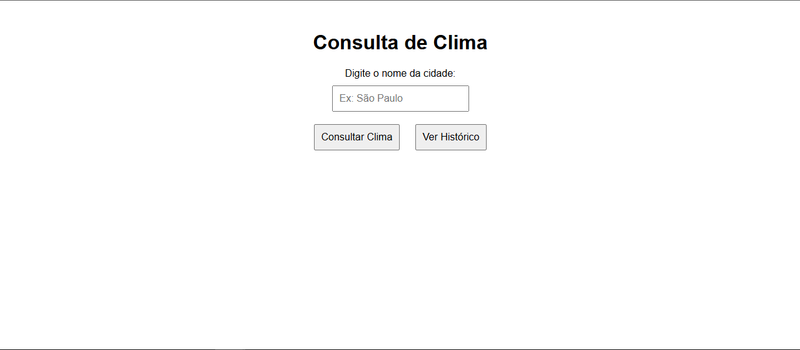
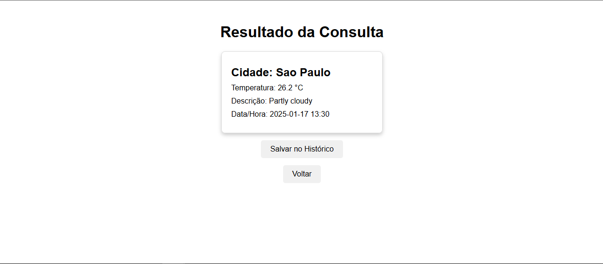
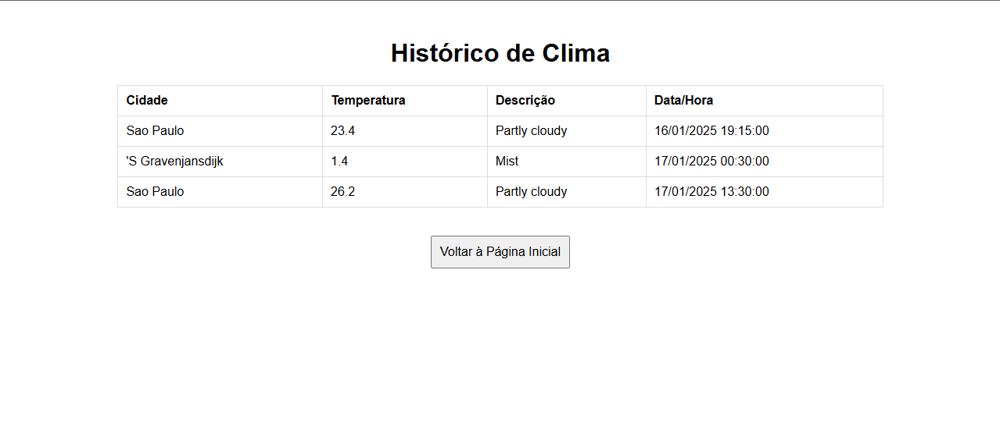

🌤️ Projeto ClimaTempo API
Um sistema web desenvolvido com Java, Spring Boot, PostgreSQL e WeatherAPI, que permite consultar informações climáticas de cidades e salvar o histórico de buscas realizadas.

🗒️ Descrição do Projeto
O ClimaTempo API é um projeto simples e funcional, com o objetivo de fornecer informações sobre o clima de qualquer cidade em tempo real. Com ele, você pode:

Consultar a temperatura de uma cidade.
Ver a descrição do clima (ensolarado, nublado, etc.).
Visualizar a data e hora da pesquisa.
Salvar as consultas realizadas em um histórico para referência futura.

🚀 Funcionalidades do Sistema

1. Página Inicial (Index) 🏠
A página inicial contém um campo de entrada onde o usuário pode inserir o nome da cidade que deseja consultar.

2. Consulta de Clima 🌡️
Após realizar a consulta, o sistema redireciona para uma página que exibe:

Nome da cidade pesquisada.
Temperatura em graus Celsius.
Descrição do clima.
Data e hora da pesquisa realizada.

3. Salvar no Histórico 💾
Na página de resultado, o usuário tem a opção de salvar a pesquisa no banco de dados, armazenando as informações para consultas futuras.

4. Página de Histórico 🕒
Uma página dedicada que exibe todas as buscas realizadas, listando:

Nome da cidade.
Temperatura.
Descrição do clima.
Data e hora de cada consulta.

🛠️ Tecnologias Utilizadas
Java com Spring Boot (versão 3.4.1).
PostgreSQL como banco de dados relacional.
WeatherAPI para consumo de dados climáticos.
Thymeleaf para renderização de páginas (se aplicável).
Maven para gerenciamento de dependências.

📖 Como Executar o Projeto
Pré-requisitos:
Java 21 instalado.
Maven configurado.
Banco de dados PostgreSQL configurado.

Passos:
1. Clone o repositório:
git clone https://github.com/seu-usuario/clima-tempo-api.git
cd clima-tempo-api

2. Configure o arquivo application.properties com as credenciais do PostgreSQL:
spring.datasource.url=jdbc:postgresql://localhost:5432/seu-banco
spring.datasource.username=seu-usuario
spring.datasource.password=sua-senha
spring.jpa.hibernate.ddl-auto=update
spring.jpa.show-sql=true

3. Compile e execute o projeto:
mvn spring-boot:run

✍️ Sobre o Autor
Desenvolvido por Lucas, estudante de Tecnologia da Informação focado em desenvolvimento back-end.
Este projeto foi criado como parte de um estudo para integrar diversas tecnologias e práticas de programação modernas.